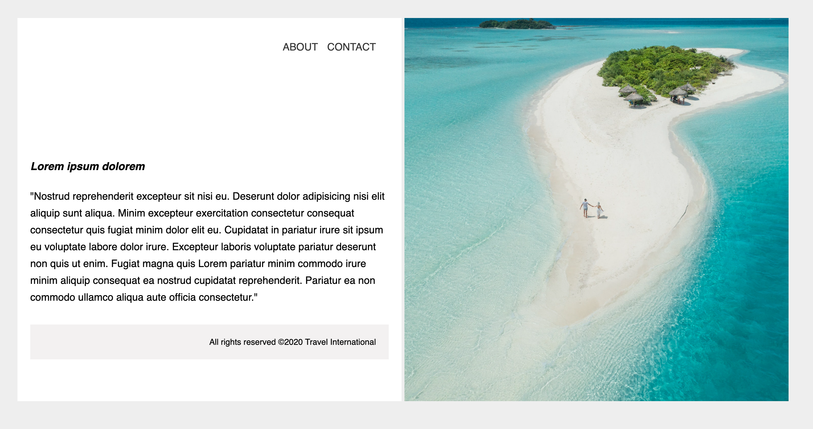

# Travel Webpage

You will create a simple travel agency page with text and an image

### Design Mock-up

- Work in `index.html` and `styles.css`
- Use semantic HTML tags (e.g. for navigation)
- You should use the `background-image` property
- Use section tags to create the split section on the page
- As always, make your webpage pixel-perfect to the reference image
- **ABOUT** and **CONTACT** should have a heavier `font-weight` on `:hover`
- As a bonus, link other pages in the navigation

[//]: # (autograding info start)
#  Results
> ⌛ Give it a minute. As long as you see the orange dot  on top, CodeBuddy is still processing. Refresh this page to see it's current status.
>
> This is what CodeBuddy found when running your code. It is to show you what you have achieved and to give you hints on how to complete the exercise.

### Travel Page

|                 Status                  | Check                                                                                    |
| :-------------------------------------: | :--------------------------------------------------------------------------------------- |
|  | `index.html` should contain appropriate meta tags |
|  | `index.html` should contain a title tag that is not empty |
|  | Page should contain two sections |
|  | One section Should contain a text |
|  | Page should contain a Navigation Bar |
|  | Page should contain at least one Background Image |
|  | Page should contain copyrights/Author's rights |

[🔬 Results Details](../../actions)
[🐞 Tips on Debugging](https://github.com/DCI-EdTech/autograding-setup/wiki/How-to-work-with-CodeBuddy)
[📢 Report Problem](https://docs.google.com/forms/d/e/1FAIpQLSfS8wPh6bCMTLF2wmjiE5_UhPiOEnubEwwPLN_M8zTCjx5qbg/viewform?usp=pp_url&entry.652569746=UIB-box-model-travel-page)

[//]: # (autograding info end)